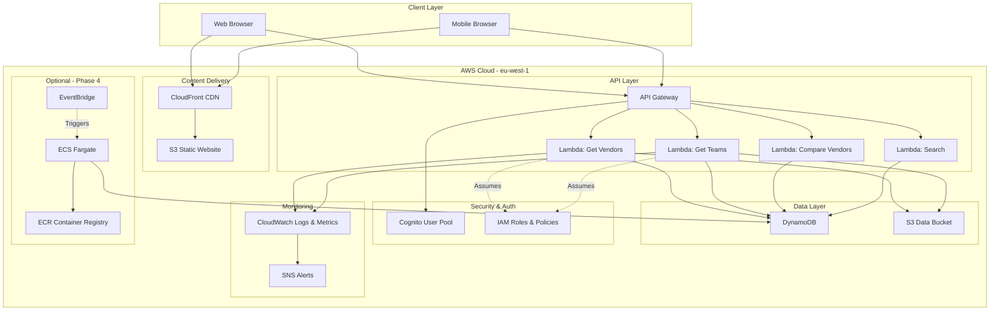
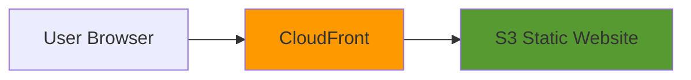
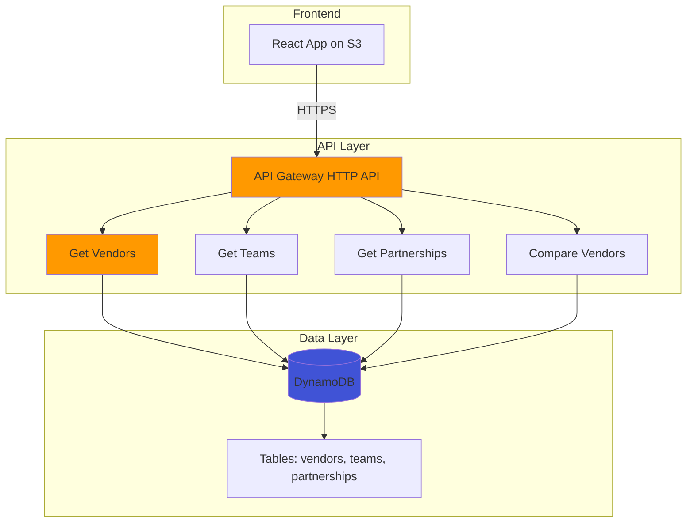
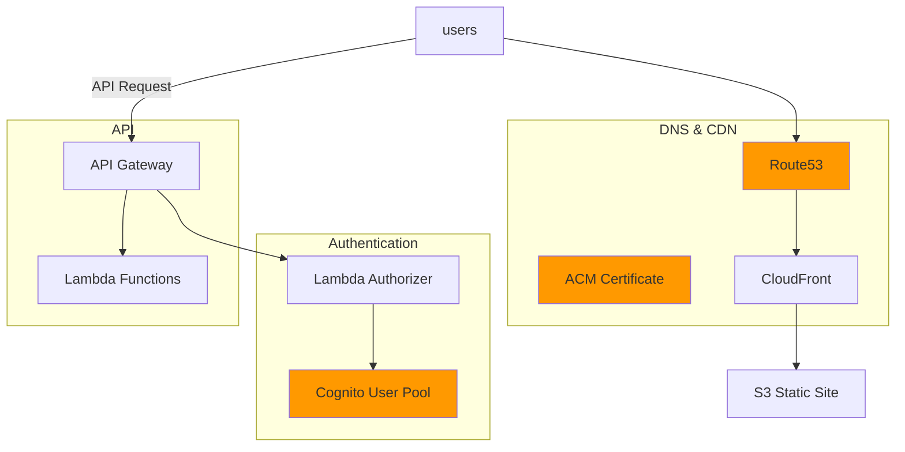
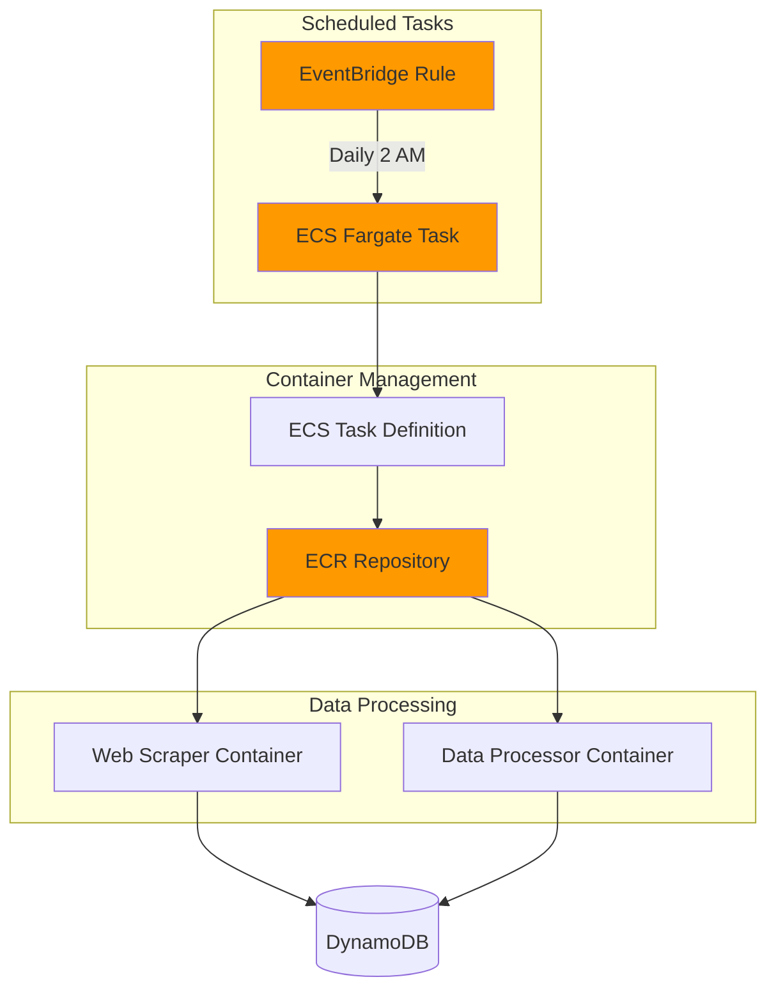
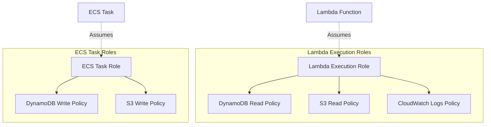
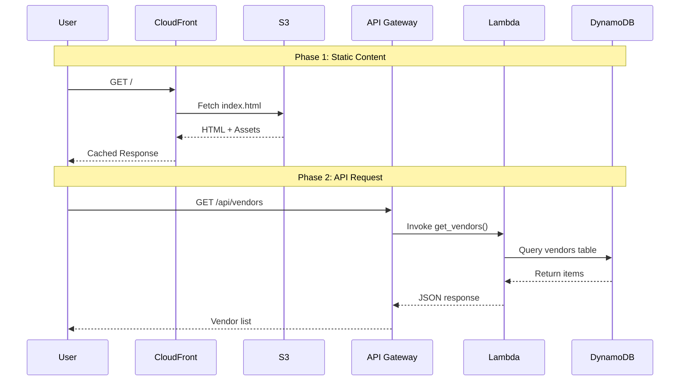
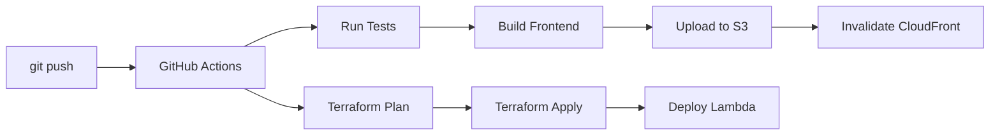

# SportsTech Cloud Platform - Architecture Documentation

**Version**: 1.0  
**Last Updated**: March 20, 2026  
**Status**: Design Phase

---

## 📐 Architecture Overview

The SportsTech Cloud Platform is a **serverless-first architecture** built on AWS, designed to provide a knowledge hub and vendor comparison platform for European sports technology.

### Design Principles

1. **Serverless-First**: Minimize infrastructure management, maximize AWS service learning
2. **Cost-Optimized**: Target < $20/month using free tier and pay-per-use services
3. **Security by Design**: Least privilege IAM, encryption at rest/transit, no hardcoded secrets
4. **Scalable**: Auto-scaling via serverless, can handle traffic spikes
5. **Well-Architected**: Follows AWS Well-Architected Framework across all 6 pillars

---

## 🏗️ High-Level Architecture



---

## 📊 Architecture by Phase

### Phase 1: Static Frontend (Weeks 1-2)



**Components**:
- **CloudFront**: Global CDN, HTTPS enforcement, caching
- **S3**: Static site hosting (React build output)

**Cost**: ~$1-2/month

---

### Phase 2: Backend API (Weeks 3-5)



**Components**:
- **API Gateway**: RESTful HTTP API, CORS enabled
- **Lambda Functions**: Python 3.11, DynamoDB access
- **DynamoDB**: NoSQL database, on-demand billing

**Cost**: +$3-5/month

---

### Phase 3: Enhanced Features (Weeks 6-8)



**New Components**:
- **Route53**: Custom domain DNS
- **ACM**: Free SSL certificates
- **Cognito**: User authentication
- **Lambda Authorizer**: Protect API endpoints

**Cost**: +$2-3/month (+ domain ~$1/month)

---

### Phase 4: Advanced Features (Week 9+)



**New Components**:
- **EventBridge**: Scheduled triggers (cron)
- **ECS Fargate**: Serverless containers
- **ECR**: Container image registry

**Cost**: +$5-10/month

---

## 🔐 Security Architecture

### IAM Roles & Policies



### Security Layers

| Layer | Security Measure | Implementation |
|-------|------------------|----------------|
| **Network** | HTTPS only | CloudFront viewer protocol policy |
| **API** | CORS restrictions | API Gateway CORS config |
| **Authentication** | User sign-in | Cognito User Pool (Phase 3) |
| **Authorization** | API access control | Lambda Authorizer + JWT validation |
| **Data Access** | Least privilege IAM | Specific DynamoDB table permissions |
| **Secrets** | No hardcoded credentials | Systems Manager Parameter Store |
| **Encryption** | At rest & in transit | S3 AES-256, DynamoDB encryption, TLS 1.2+ |
| **Logging** | Audit trail | CloudWatch Logs for all Lambda invocations |
| **Monitoring** | Security alerts | CloudWatch Alarms + SNS for anomalies |

### Well-Architected Security Pillar

**Identity & Access Management**:
- ✅ IAM roles (not users) for all services
- ✅ Least privilege policies (specific actions, specific resources)
- ✅ MFA for AWS Console access
- ✅ No hardcoded secrets (use Parameter Store or Secrets Manager)

**Detective Controls**:
- ✅ CloudWatch Logs enabled for all Lambda functions
- ✅ CloudTrail enabled for API auditing (AWS default)
- ✅ DynamoDB point-in-time recovery (Phase 3)

**Infrastructure Protection**:
- ✅ HTTPS everywhere (CloudFront, API Gateway)
- ✅ S3 bucket policies (block public write access)
- ✅ Security Groups for ECS tasks (Phase 4)

**Data Protection**:
- ✅ S3 encryption at rest (AES-256)
- ✅ DynamoDB encryption enabled
- ✅ TLS 1.2+ for data in transit
- ✅ No PII stored (vendor/team data only public information)

---

## 🌐 Network Architecture

### Region & Availability

**Primary Region**: `eu-west-1` (Ireland)

**Why eu-west-1**:
- ✅ Closest to Greece/Italy with full service availability
- ✅ Lower cost than eu-south-1 (Milan)
- ✅ More mature services, better documentation
- ✅ Global CloudFront edge locations (automatic)

**Availability Zones**:
- DynamoDB: Multi-AZ by default (managed)
- Lambda: Automatically distributed across AZs
- S3: Multi-AZ replication (managed)
- ECS Fargate: Can use multi-AZ (Phase 4, optional)

### Data Flow Diagram



### Request Flow Details

**Static Content Request**:
1. User requests `https://sportstech.cloud/`
2. DNS (Route53) resolves to CloudFront distribution
3. CloudFront checks edge cache (50+ global locations)
4. If cache miss → CloudFront fetches from S3 origin
5. CloudFront caches response (TTL: 1 hour for HTML, 1 day for assets)
6. User receives content with low latency

**API Request**:
1. React app makes `GET https://api.sportstech.cloud/vendors`
2. Request hits API Gateway regional endpoint (eu-west-1)
3. API Gateway checks authorizer (Phase 3: validates JWT)
4. API Gateway invokes Lambda function
5. Lambda queries DynamoDB (single-digit ms latency)
6. Lambda returns JSON response
7. API Gateway adds CORS headers
8. React app receives data

---

## 💾 Data Architecture

### DynamoDB Table Design

#### Table: `vendors`

**Primary Key**: `vendorId` (String, Partition Key)

**Attributes**:
```json
{
  "vendorId": "catapult-sports",           // PK
  "name": "Catapult Sports",
  "country": "Australia",
  "category": "Performance Tracking",
  "categories": ["Wearables", "Analytics"], // Multi-category
  "technology": "GPS/IMU wearables + Vector platform",
  "website": "https://www.catapultsports.com",
  "foundedYear": 2006,
  "pricingEstimate": "€50-120K/year",
  "pricingCurrency": "EUR",
  "pricingMin": 50000,
  "pricingMax": 120000,
  "clients": ["Real Madrid", "FC Barcelona"], // Array
  "clientCount": 2,
  "description": "Market leader in GPS/IMU wearables...",
  "validationLevel": "confirmed",
  "sources": ["Official case study", "Team sponsor page"],
  "logoUrl": "s3://bucket/logos/catapult.png",
  "features": ["GPS tracking", "Load management", "Video integration"],
  "marketPresence": "Global",
  "createdAt": "2026-03-20T10:00:00Z",
  "updatedAt": "2026-03-20T10:00:00Z"
}
```

**Indexes**:
- **GSI1**: `category-clientCount-index` (for filtering by category, sorting by popularity)
  - PK: `category` (String)
  - SK: `clientCount` (Number)

**Access Patterns**:
1. Get vendor by ID: `Query` on vendorId
2. List all vendors: `Scan` (acceptable for < 1000 items)
3. Filter by category: `Query` on GSI1
4. Search by name: `Scan` with FilterExpression (or use Lambda for full-text search)

---

#### Table: `teams`

**Primary Key**: `teamId` (String, Partition Key)

**Attributes**:
```json
{
  "teamId": "real-madrid",                // PK
  "name": "Real Madrid",
  "fullName": "Real Madrid Baloncesto",
  "country": "Spain",
  "city": "Madrid",
  "league": "Euroleague",
  "arena": "WiZink Center",
  "founded": 1932,
  "website": "https://www.realmadrid.com/en/basketball",
  "transparencyRating": 4,                // 1-5 (data availability)
  "partnerships": [
    {
      "vendorId": "catapult-sports",
      "vendorName": "Catapult Sports",
      "category": "Performance Tracking",
      "source": "Official case study",
      "dateConfirmed": "2026-01-15",
      "validationLevel": "confirmed"
    }
  ],
  "partnershipCount": 1,
  "staff": [],                             // S&C staff (future)
  "logoUrl": "s3://bucket/logos/real-madrid.png",
  "createdAt": "2026-03-06T10:00:00Z",
  "updatedAt": "2026-03-06T10:00:00Z"
}
```

**Indexes**:
- **GSI1**: `country-partnershipCount-index`
  - PK: `country` (String)
  - SK: `partnershipCount` (Number)

**Access Patterns**:
1. Get team by ID: `Query` on teamId
2. List all teams: `Scan`
3. Filter by country: `Query` on GSI1
4. Teams by partnership count: `Query` on GSI1 with sort

---

#### Table: `partnerships`

**Primary Key**: 
- Partition Key: `partnershipId` (String, format: `{teamId}-{vendorId}`)

**Attributes**:
```json
{
  "partnershipId": "real-madrid-catapult-sports", // PK
  "teamId": "real-madrid",                        // GSI1 PK
  "vendorId": "catapult-sports",                  // GSI2 PK
  "category": "Performance Tracking",
  "source": "Official Real Madrid case study",
  "sourceUrl": "https://...",
  "dateConfirmed": "2026-01-15",
  "validationLevel": "confirmed",                 // confirmed | estimated | rumored
  "notes": "Confirmed via official press release",
  "createdAt": "2026-03-20T10:00:00Z",
  "updatedAt": "2026-03-20T10:00:00Z"
}
```

**Indexes**:
- **GSI1**: `teamId-index` (find all vendors for a team)
  - PK: `teamId` (String)
- **GSI2**: `vendorId-index` (find all teams for a vendor)
  - PK: `vendorId` (String)

**Access Patterns**:
1. Get specific partnership: `Query` on partnershipId
2. All vendors used by team: `Query` on GSI1 (teamId)
3. All teams using vendor: `Query` on GSI2 (vendorId)
4. All partnerships: `Scan`

---

### Data Migration Strategy

**Source**: Markdown files in `Euroleague Tech/` folder

**Migration Script** (`data-migration/populate_dynamodb.py`):
1. Parse all `.md` files in `euroleague-tech-products.md`, `CONFIRMED-FACTS-ONLY.md`
2. Extract vendor data (regex or structured parsing)
3. Extract team data from `euroleague-teams/` folder
4. Build partnership relationships
5. Validate data (required fields, format)
6. Batch write to DynamoDB (25 items per batch)
7. Log migration results (success, errors, warnings)

**Data Validation**:
- Required fields: vendorId, name, category
- URL format validation
- Price range validation (min < max)
- Date format: ISO 8601
- Deduplication (check existing vendorId before insert)

---

## 🔧 Component Details

### Lambda Functions

#### `get_vendors` Function

**Purpose**: List all vendors with optional filtering

**Endpoint**: `GET /api/vendors?category={category}&country={country}`

**Input**:
```json
{
  "queryStringParameters": {
    "category": "Performance Tracking",
    "country": "Australia",
    "limit": 50
  }
}
```

**Logic**:
1. Parse query parameters
2. If `category` provided → Query GSI1
3. Else → Scan table
4. Apply additional filters (country, etc.)
5. Return sorted list (by clientCount desc)

**Output**:
```json
{
  "statusCode": 200,
  "body": {
    "vendors": [...],
    "count": 12,
    "filters": {
      "category": "Performance Tracking"
    }
  }
}
```

**IAM Permissions**:
- `dynamodb:Query` on `vendors` table
- `dynamodb:Scan` on `vendors` table
- `dynamodb:Query` on GSI1

---

#### `compare_vendors` Function

**Purpose**: Compare 2-4 vendors side-by-side

**Endpoint**: `POST /api/compare`

**Input**:
```json
{
  "vendorIds": ["catapult-sports", "kinexon", "wimu-pro"]
}
```

**Logic**:
1. Validate vendorIds (2-4 items)
2. Batch get from DynamoDB
3. Extract comparable fields (pricing, features, clients, etc.)
4. Structure comparison table
5. Return formatted comparison

**Output**:
```json
{
  "statusCode": 200,
  "body": {
    "comparison": {
      "vendors": [
        {
          "vendorId": "catapult-sports",
          "name": "Catapult Sports",
          "pricing": "€50-120K/year",
          "clients": ["Real Madrid", "Barcelona"],
          "features": ["GPS", "IMU", "Video"]
        },
        ...
      ],
      "matrix": {
        "pricing": {
          "catapult-sports": "€50-120K",
          "kinexon": "€40-100K",
          "wimu-pro": "€30-80K"
        }
      }
    }
  }
}
```

---

### API Gateway

**Type**: HTTP API (cheaper, simpler than REST API)

**Base URL**: `https://{api-id}.execute-api.eu-west-1.amazonaws.com`

**Routes**:
| Method | Path | Lambda | Auth |
|--------|------|--------|------|
| GET | `/vendors` | `get_vendors` | None (public) |
| GET | `/vendors/{id}` | `get_vendor_by_id` | None |
| GET | `/teams` | `get_teams` | None |
| GET | `/teams/{id}` | `get_team_by_id` | None |
| POST | `/compare` | `compare_vendors` | None |
| GET | `/search?q={query}` | `search` | None |
| POST | `/partnerships` | `create_partnership` | Cognito (Phase 3) |

**CORS Configuration**:
```json
{
  "allowOrigins": ["https://sportstech.cloud", "http://localhost:5173"],
  "allowMethods": ["GET", "POST", "OPTIONS"],
  "allowHeaders": ["Content-Type", "Authorization"],
  "maxAge": 3600
}
```

**Throttling**:
- Rate limit: 1000 requests/second (default)
- Burst limit: 2000 requests (default)
- Can adjust per stage

---

### CloudFront Distribution

**Origins**:
1. **Primary Origin**: S3 static website bucket
2. **API Origin**: API Gateway (Phase 2+)

**Behaviors**:
| Path Pattern | Origin | Cache Policy | Viewer Protocol |
|--------------|--------|--------------|-----------------|
| `/` | S3 | CachingOptimized | Redirect to HTTPS |
| `/api/*` | API Gateway | CachingDisabled | HTTPS only |
| `/assets/*` | S3 | CachingOptimized (1 day TTL) | Redirect to HTTPS |

**Custom Error Responses**:
- 404 → /index.html (SPA routing)
- 403 → /index.html

**Price Class**: Use Only US, Canada, Europe (cheaper, covers target audience)

**SSL Certificate**: ACM certificate for custom domain (Phase 3)

---

## 📈 Monitoring & Observability

### CloudWatch Metrics

**Lambda Metrics**:
- Invocations (count)
- Duration (ms)
- Errors (count)
- Throttles (count)
- Concurrent Executions

**API Gateway Metrics**:
- Count (requests)
- 4XXError (client errors)
- 5XXError (server errors)
- Latency (ms)

**DynamoDB Metrics**:
- ConsumedReadCapacityUnits
- ConsumedWriteCapacityUnits
- UserErrors (e.g., validation failures)
- SystemErrors (AWS-side issues)

**CloudFront Metrics**:
- Requests (count)
- BytesDownloaded
- 4xxErrorRate
- 5xxErrorRate
- CacheHitRate

---

### CloudWatch Alarms

| Alarm | Metric | Threshold | Action |
|-------|--------|-----------|--------|
| **High API Error Rate** | API Gateway 5XXError | > 10 errors in 5 min | SNS notification |
| **Lambda Errors** | Lambda Errors | > 5 errors in 5 min | SNS notification |
| **High Cost** | EstimatedCharges | > $20 | SNS email alert |
| **DynamoDB Throttling** | UserErrors | > 10 in 5 min | SNS notification |

---

### CloudWatch Logs

**Log Groups**:
- `/aws/lambda/get_vendors`
- `/aws/lambda/get_teams`
- `/aws/lambda/compare_vendors`
- `/aws/apigateway/sportstech-api-dev`

**Log Retention**: 7 days (cost optimization)

**Log Insights Queries** (examples):
```sql
-- Top 10 most requested vendors
fields @timestamp, vendorId
| filter requestType = "get_vendor_by_id"
| stats count() by vendorId
| sort count desc
| limit 10

-- API latency p95
fields @timestamp, duration
| filter @type = "REPORT"
| stats percentile(duration, 95) as p95_latency
```

---

## 💰 Cost Architecture

### Cost Breakdown by Service (Monthly Estimates)

#### Phase 1: Static Frontend
| Service | Usage | Cost |
|---------|-------|------|
| **S3** | 5 GB storage, 10K requests | $0.12 |
| **CloudFront** | 50 GB data transfer, 100K requests | $4.25 |
| **Route53** | 1 hosted zone (optional) | $0.50 |
| **Total Phase 1** | | **~$5** |

#### Phase 2: Backend API
| Service | Usage | Cost |
|---------|-------|------|
| **Lambda** | 100K invocations, 512MB, 1s avg | $0.20 |
| **API Gateway** | 100K requests | $0.10 |
| **DynamoDB** | 1M reads, 100K writes, 1GB storage | $1.50 |
| **Total Phase 2** | | **+$2** |

#### Phase 3: Custom Domain + Auth
| Service | Usage | Cost |
|---------|-------|------|
| **Route53** | 1 hosted zone, 1M queries | $0.90 |
| **Cognito** | 1K MAU | $0 (free tier) |
| **ACM** | SSL certificate | $0 (free for CloudFront) |
| **Total Phase 3** | | **+$1** |

#### Phase 4: ECS Fargate
| Service | Usage | Cost |
|---------|-------|------|
| **ECS Fargate** | 0.25 vCPU, 0.5GB RAM, 1 hour/day | $3.50 |
| **ECR** | 2 images, 1GB storage | $0.10 |
| **EventBridge** | 30 events/month | $0 (free tier) |
| **Total Phase 4** | | **+$4** |

---

### Total Cost Projection

| Phase | Monthly Cost | Cumulative |
|-------|--------------|------------|
| Phase 1 | ~$5 | $5 |
| Phase 2 | +$2 | $7 |
| Phase 3 | +$1 | $8 |
| Phase 4 | +$4 | $12 |

**With domain**: +$1/month (amortized)  
**Grand Total**: ~$12-15/month (well under $20 target)

---

### Free Tier Utilization (First 12 Months)

| Service | Free Tier | Covers You? |
|---------|-----------|-------------|
| **Lambda** | 1M requests + 400K GB-seconds/month | ✅ Yes (100K/month) |
| **DynamoDB** | 25 GB storage + 25 WCU + 25 RCU | ✅ Yes (1GB, low traffic) |
| **CloudFront** | 1TB data transfer + 10M requests | ✅ Yes (50GB/month) |
| **S3** | 5GB storage + 20K GET + 2K PUT | ✅ Yes (5GB) |
| **Cognito** | 50K MAU | ✅ Yes (1K users) |

**Conclusion**: With free tier, could be **< $5/month** for first year!

---

## 🔄 CI/CD Architecture

### GitHub Actions Workflow



**Workflow Files**:
1. `.github/workflows/deploy-frontend.yml` - On push to `main`, build React → S3
2. `.github/workflows/deploy-backend.yml` - On push to `backend/`, package Lambda → deploy
3. `.github/workflows/terraform-pr.yml` - On PR, run `terraform plan`
4. `.github/workflows/terraform-apply.yml` - On merge to `main`, run `terraform apply`

---

## 🏛️ Well-Architected Framework Assessment

### Operational Excellence
- ✅ Infrastructure as Code (Terraform)
- ✅ CI/CD automation (GitHub Actions)
- ✅ CloudWatch monitoring and logging
- ✅ Runbooks in docs/ folder
- ⚠️ Manual deployment initially (automate in Phase 4)

### Security
- ✅ Least privilege IAM roles
- ✅ Encryption at rest (S3, DynamoDB)
- ✅ Encryption in transit (HTTPS)
- ✅ No hardcoded secrets
- ✅ MFA on AWS account
- ✅ CloudTrail enabled (AWS default)

### Reliability
- ✅ Multi-AZ services (Lambda, DynamoDB, S3)
- ✅ Auto-scaling (serverless)
- ✅ Backup enabled (DynamoDB PITR in Phase 3)
- ⚠️ Single region (acceptable for MVP)
- ⚠️ No disaster recovery plan yet

### Performance Efficiency
- ✅ Right-sized Lambda (512MB, adjust based on metrics)
- ✅ DynamoDB on-demand (no capacity planning)
- ✅ CloudFront caching (global edge locations)
- ✅ Serverless = zero idle resources
- ✅ API Gateway caching (Phase 3)

### Cost Optimization
- ✅ Serverless pay-per-use model
- ✅ Free tier utilization
- ✅ CloudWatch cost alarms
- ✅ S3 lifecycle policies for old data
- ✅ DynamoDB on-demand (cheaper for low traffic)
- ✅ CloudFront price class optimization

### Sustainability
- ✅ Serverless = no idle instances (energy efficient)
- ✅ Managed services (AWS optimizes data centers)
- ✅ Regional selection (eu-west-1 uses renewable energy)
- ✅ Minimal resource footprint

---

## 🔮 Future Enhancements (Beyond Phase 4)

### Technical Enhancements
1. **GraphQL API** (replace REST for flexibility)
2. **Search with OpenSearch** (better than DynamoDB scan)
3. **Multi-region** (CloudFront + DynamoDB global tables)
4. **Real-time updates** (WebSockets via API Gateway)
5. **Mobile app** (React Native + Amplify)

### Feature Enhancements
1. **User-submitted reviews** (Cognito auth + moderation)
2. **Email notifications** (SES for new vendors/updates)
3. **RSS feed** (S3 static XML generation)
4. **Analytics dashboard** (internal metrics)
5. **ML recommendations** ("Teams similar to yours use...")

### Data Enhancements
1. **Automated web scraping** (detect new partnerships)
2. **API integrations** (vendor APIs if available)
3. **Social media monitoring** (Twitter/LinkedIn for announcements)
4. **Historical pricing trends** (track pricing changes over time)

---

## 📚 Reference Architecture

This architecture follows AWS patterns from:
- [AWS Serverless Web Application Reference](https://docs.aws.amazon.com/lambda/latest/dg/lambda-runtimes.html)
- [AWS Well-Architected Serverless Lens](https://docs.aws.amazon.com/wellarchitected/latest/serverless-applications-lens/welcome.html)
- [AWS Solutions Library - Web Applications](https://aws.amazon.com/solutions/)

---

## 🎯 Key Design Decisions (ADRs)

### ADR-001: Why Serverless Over EC2
**Decision**: Use Lambda + API Gateway instead of EC2 + k3s

**Rationale**:
- Minimize VM management (aligns with Terna's "reduce VMs" direction)
- Maximize AWS service exposure for SAA exam (15+ services vs 5-7)
- Lower cost ($5-15/month vs $15-25/month)
- Auto-scaling without configuration
- Industry trend toward serverless

**Trade-offs**:
- ❌ Skips Kubernetes learning (can do separately for CKA)
- ❌ Lambda limitations (15 min timeout, cold starts)
- ✅ Faster to production, easier to maintain

---

### ADR-002: Why DynamoDB Over RDS
**Decision**: Use DynamoDB (NoSQL) instead of RDS PostgreSQL

**Rationale**:
- On-demand pricing (no idle cost)
- Auto-scaling (no capacity planning)
- Simple data model (no complex joins needed)
- Better for SAA exam (DynamoDB heavily tested)
- Millisecond latency (better performance)

**Trade-offs**:
- ❌ Less familiar query language (vs SQL)
- ❌ Harder to do ad-hoc queries (vs SQL)
- ✅ Better cost for low traffic, better scalability

---

### ADR-003: Why HTTP API Over REST API (API Gateway)
**Decision**: Use HTTP API instead of REST API

**Rationale**:
- 70% cheaper ($1.00 vs $3.50 per million requests)
- Simpler configuration (fewer features = less complexity)
- Sufficient for our use case (CORS, Lambda proxy)
- Faster performance (lower latency)

**Trade-offs**:
- ❌ Missing: API keys, usage plans, request validation
- ✅ Cheaper, simpler, faster

---

### ADR-004: Why ECS Fargate Over EKS
**Decision**: Use ECS Fargate (Phase 4) instead of EKS

**Rationale**:
- No Kubernetes complexity needed
- No $75/month control plane cost
- Sufficient for container learning
- Better for AWS-specific skills (SAA exam)

**Trade-offs**:
- ❌ Not Kubernetes (miss CKA prep)
- ✅ Cheaper, simpler, AWS-native
- ✅ Can learn Kubernetes separately on laptop (k3s/minikube)

---

## 📖 Appendix

### Naming Conventions

**Resources**: `{project}-{env}-{service}-{resource}-{number}`

Examples:
- S3 bucket: `sportstech-dev-frontend-website`
- Lambda: `sportstech-dev-api-get-vendors`
- DynamoDB: `sportstech-dev-data-vendors`
- IAM role: `sportstech-dev-lambda-execution-role`

**Terraform**:
- Modules: lowercase, hyphens (e.g., `s3-static-site`)
- Variables: lowercase, underscores (e.g., `bucket_name`)
- Outputs: lowercase, underscores (e.g., `cloudfront_url`)

---

### Glossary

- **CDN**: Content Delivery Network (CloudFront)
- **CORS**: Cross-Origin Resource Sharing
- **DDB**: DynamoDB (AWS NoSQL database)
- **GSI**: Global Secondary Index (DynamoDB)
- **IAM**: Identity and Access Management
- **PK**: Partition Key (DynamoDB primary key)
- **SK**: Sort Key (DynamoDB range key)
- **TTL**: Time To Live (cache expiration)
- **WAF**: Well-Architected Framework

---

**Version**: 1.0  
**Next Review**: After Phase 2 completion  
**Owner**: Dimitris  
**Last Updated**: March 20, 2026
